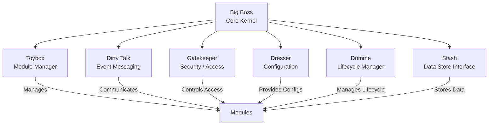

# Core System Overview

## Purpose
The Core System is the backbone of the Nexus project.  
It orchestrates all activity, manages system state, ensures security, and enables modules to interact seamlessly while maintaining isolation and control.

---

## Architecture
The Core System consists of seven primary components:

| Component            | Mnemonic Name | Role                                                                 |
|---------------------|---------------|----------------------------------------------------------------------|
| Core Kernel          | Big Boss      | Central orchestrator; manages system state and flow                  |
| Module Manager       | Toybox        | Loads, supervises, and interacts with all modules                    |
| Event / Messaging    | Dirty Talk    | Messaging bus for internal module communication                      |
| Configuration        | Dresser       | Stores and provides runtime settings and preferences                 |
| Security / Access    | Gatekeeper    | Controls permissions and access to resources                         |
| Lifecycle Manager    | Domme         | Handles module start, stop, reload, and updates                      |
| Data Store Interface | Stash         | Secure storage interface for persistent data                         |

---

## Flow of Control

### 1. Initialization
- **Big Boss** starts the Core System.
- **Dresser** loads system configuration and preferences.
- **Gatekeeper** sets up module permissions and access control.
- **Toybox** loads all available modules.
- **Domme** initializes module lifecycle states.

### 2. Runtime Operation
- **Dirty Talk** handles asynchronous messages between modules.
- **Big Boss** monitors module activity, orchestrates execution, and maintains system health.
- **Gatekeeper** enforces access rules whenever a module requests resources.
- **Stash** provides secure data persistence as needed.

### 3. Module Lifecycle
- **Domme** manages starting, stopping, reloading, and updating modules in a controlled sequence.
- **Toybox** ensures modules do not conflict or interfere with each other.

### 4. Shutdown / Cleanup
- **Domme** orchestrates graceful shutdown of modules.
- **Big Boss** ensures all system state is safely stored.
- **Stash** commits any remaining data securely.

---

## Security & Isolation
- Modules communicate internally **only via Dirty Talk**.
- **Gatekeeper** ensures modules cannot access unauthorized data or system resources.
- External communications are explicitly controlled and only allowed when necessary.
- Isolation ensures a module cannot compromise core or other modules.

---

## Extensibility
- New modules can be added to **Toybox** without changing core logic.
- **Dirty Talk** supports additional message types and communication patterns.
- Configuration via **Dresser** allows runtime flexibility and dynamic changes.
- Core architecture is language-agnostic, enabling **multi-language module support**.

---

## Notes / Design Decisions
- Mnemonic names provide a memorable, internal shorthand for each core component.
- The Core System is designed for **isolation, security, and modularity**.
- Components are **loosely coupled** but orchestrated centrally by **Big Boss**.
- Every core action flows through clearly defined channels, ensuring predictable behavior.

---

## Visual Diagram (Placeholder)

*Note: Replace placeholder with actual flowchart or diagram in the future.
